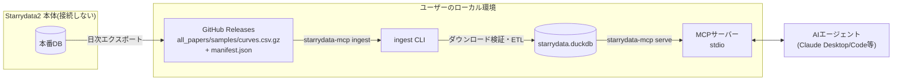
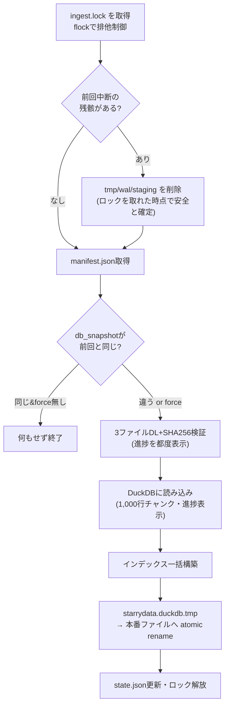
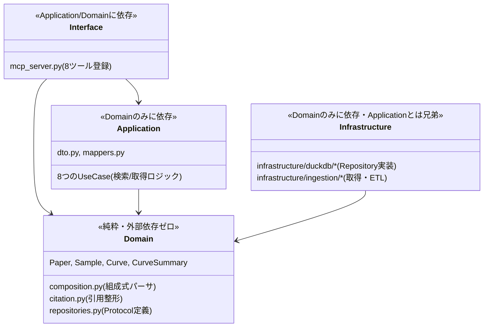

# starrydata-mcp 技術解説

対象読者: プロジェクトオーナー(エンジニア、Starrydata開発者)。
実装の「何を」だけでなく「なぜそう作ったか」を、実際に踏んだ不具合も含めて説明する。

関連ドキュメント: [`docs/design/architecture.md`](design/architecture.md)(初期設計・実データ調査)、[`docs/RELEASE_NOTES_DRAFT.md`](RELEASE_NOTES_DRAFT.md)(変更履歴)。

---

## 1. 全体像

### 1.1 なぜMCPサーバーか

Starrydataは論文の図から人手/半自動で抽出した材料物性データベースであり、"組成×物性×温度依存性" のような多次元検索はAIエージェントが最も強みを発揮できる領域である。一方でエージェントに使わせるには、

- 検索粒度がエージェントの語彙(組成式、元素記号、物性名)と一致していること
- 1回の呼び出しで返すデータ量が肥大化してエージェントのコンテキストを圧迫しないこと
- ツールの`description`だけを読んで正しく使えること(LLMO)

が必要で、これはREST APIの薄いラッパーではなく「検索→絞り込み→取得」という段階を持つツール設計が要る。MCPはこの用途に最も自然なプロトコルだった。

### 1.2 アーキテクチャ上の絶対制約

Starrydata本番DB・本番APIには一切接続しない。本プロジェクトは公式に公開配布されているデータセットのみを利用する方針であり、この制約が設計全体を貫いている: ローカルにDuckDBレプリカを持ち、MCPサーバーはそのレプリカだけを見る。

### 1.3 データの流れ



本サーバーが触れるのは常に「昨日〜今日の公開スナップショット」であり、本番DBの可用性・負荷には一切影響しない。リアルタイム性が要らないという製品要件とも一致する。

---

## 2. ingestパイプライン

### 2.1 取得元の選定

CLAUDE.mdの制約は「データセットZIP」という表現だったが、実際に機械的な日次取得に向くのは Google Drive の全量ZIPではなく **GitHub Releases** だった(設計時にHQ承認済み、`docs/design/architecture.md` §1.4)。理由:

- 固定URL(`.../releases/latest/download/<file>`)で認証不要にアクセスできる
- `manifest.json` に `db_snapshot` 文字列と各ファイルのSHA256が入っており、変更検知と整合性検証がそのままできる

### 2.2 パイプラインの構造

`infrastructure/ingestion/pipeline.py` の `run_ingest()` が全体を統括する。



「常にフルリビルド、差分マージはしない」という設計方針(§design doc 2.2)は今回も維持している。件数(56,521 papers行 / 105,397 samples / 234,390 curves)であれば差分ロジックの複雑さに見合わないという判断。

### 2.3 実際に踏んだ不具合と設計への反映

このパイプラインは「オーナーが実際にingestを実行して踏んだ不具合」の修正を経て今の形になっている。当初の実装は「ダウンロード→ETL→atomic rename」だけで、進捗表示もロックもSIGINT対応も無かった。

**不具合A: 無言のまま8分経過→ハングと誤解してCtrl+C**

原因は単純で、進捗を一切表示していなかったこと。修正は3段階:

1. `downloader.py`: ファイルごとに「ダウンロード開始(サイズ)」「完了(所要時間)」を表示
2. `etl.py`: 234,390行を1回の`executemany`で流し込んでいたのを**1,000行チャンク**に分割し、チャンクごとに進捗表示
3. 併せて `run_ingest` の実測時間見積りを更新(後述の性能バグ発覚を受けて「5〜10分」という当初の見込みは誤りだったと判明し、「15〜30分」に訂正した)

**不具合B: 中断後の再実行が `Could not set lock on starrydata.duckdb.tmp.wal (Conflicting lock held by PID …)` で失敗**

調査の結果、原因は「旧コードが中断時のクリーンアップで `.tmp` ファイルは消していたが、DuckDBが書き込み時に作る `.tmp.wal`(WAL: Write-Ahead-Log)サイドカーファイルは消していなかった」こと。次回起動時にDuckDBがこの残骸`.wal`を検知してロック確認に行き、紛らわしいエラーになっていた。ライブDB本体(atomic renameで守られている)は無傷だったが、エラーメッセージだけでは分からなかった。

修正は「本当に別プロセスが動いているか」を**推測ではなく事実として確定**させる設計にした:

- `cache_dir/ingest.lock` に対する `flock`(POSIX advisory lock)を起動時に取得
- 取得できなければ「別のingestが本当に実行中」と確定できるので、保持者PIDを名指しした`IngestAlreadyRunningError`を返す(DuckDBの内部エラーを推測で解釈させない)
- 取得できれば「前回のプロセスは確実に死んでいる」と確定できるので、残っている `.tmp` / `.tmp.wal` / `staging/` を**無条件かつ安全に**削除してから開始する

**不具合C: Ctrl+Cが効かない(進捗表示・チャンク分割だけでは解決しなかった)**

チャンク分割すれば「チャンクの間でPythonに制御が戻るのでSIGINTが刺さるはず」という想定だったが、実際に本番相当データで検証すると刺さらなかった。切り分けのため実際にサブプロセスを立てて`SIGINT`を送る再現テストを書いたところ、2つの独立した事実が判明した:

1. DuckDBのコネクションを開くとPythonのデフォルトSIGINTハンドラの挙動が変わる(クエリ実行中の割り込みが素直に効かないケースがある)。これ自体は`signal.signal(signal.SIGINT, signal.default_int_handler)`を明示的に再設定すれば単体では動くことを確認したが、**DuckDBのC拡張の非公開の内部挙動に依存する**ことになるため、本番の中断経路として採用するのは避けた。
2. 「Ctrl+Cが効かない」ように見えた事象の大部分は、実はシグナル処理の問題ではなく **1件あたりのチャンク処理が想定よりずっと遅かった**ため(詳細は2.4)。

最終的に採用したのは `infrastructure/ingestion/interrupt.py` の**協調的中断**方式:

- SIGINTハンドラは「フラグを立てるだけ」で、DuckDBの呼び出し中に割り込みを試みることは一切しない
- `on_progress`コールバック(チャンク処理後・ファイルDL後に必ず呼ばれる)の中でフラグを確認し、立っていれば`InterruptRequested`(`KeyboardInterrupt`のサブクラス)を**Python側のコードから**送出する
- 2回目のCtrl+Cは即座に`SIG_DFL`へ戻して強制終了するエスケープハッチ

この方式は「割り込みの即時性」をわずかに犠牲にする(最悪ケースで1チャンク分の待ち)代わりに、DuckDBのバージョンに依存しない再現性のある動作を選んだ。

### 2.4 性能バグ: インデックスを先に作っていた

Ctrl+Cの検証中に、1,000行のチャンクが実測で数十秒かかることがあると分かった。原因はスキーマ設計にあった: `samples.sample_uid` と `curves.curve_id` に `PRIMARY KEY`、さらに`sid`や`prop_x, prop_y`に検索用インデックスを、**データを1行も入れる前に**作っていた。この状態でチャンク挿入すると、挿入のたびにインデックス(とPRIMARY KEYの一意性チェック)を差分更新することになり、コストが行数に対して急激に悪化する。

修正は一般的なDB設計の定石通り: `schema.py` を `create_tables()`(制約なしのテーブル定義)と `create_indexes()`(索引の一括構築)に分離し、**全データロード後に一度だけ**インデックスを構築するようにした。合わせて、`curve_id`・`sample_uid`の一意性はDB制約ではなくETL側の生成ロジック(`curve_id`は連番、`sample_uid`は`f"{SID}:{sample_id}"`)で保証する設計に変えた。

この修正で判明した副産物として、**当初「フル実行5〜10分」と見積もっていたのは誤りで、実測では15〜30分かかる**ことが分かった(ダウンロード自体は数秒〜十数秒で終わり、約40万行を`executemany`で読み込む部分が支配的)。README・進捗メッセージはこの実測値に訂正済み。より高速なDuckDBネイティブCOPY取り込みへの移行は、現在Python側で行っている行ごとの変換(JSON解析・組成式パースなど)をSQL側に持っていく必要があり、今回のバグ修正のスコープを超えるためフォローアップ課題として`RELEASE_NOTES_DRAFT.md`に記録した。

---

## 3. DuckDBスキーマと設計判断

### 3.1 DuckDB vs SQLite

検索パターンは「組成・元素・物性でサンプルや曲線を絞り込み、該当する(x, y)配列をそのまま返す」という分析的なクエリが中心であり、点別の正規化テーブルへのJOINより列指向DBの方が実装・性能ともに有利と判断した。決め手:

| 観点 | 採用理由 |
|---|---|
| 配列型 | `LIST(DOUBLE)`をネイティブに1カラムへ格納でき、曲線の点別展開テーブルが不要 |
| JSON型 | `sample_info`・`project_names`をそのままクエリでき、正規化コストを削減 |
| ゾーンマップ | `x_min`/`x_max`等の材料化列だけで温度域フィルタが高速化 |
| 利用形態との一致 | 「1プロセスが書き込み→以降は読み取り専用」という運用にDuckDBの同時書き込み不可という制約がそのまま合致 |

### 3.2 テーブル構成

`papers` / `samples` / `curves` / `dataset_meta` の4テーブル。詳細は `infrastructure/duckdb/schema.py` を参照。設計上の要点:

- `papers.sid` に**あえてPRIMARY KEYを付けていない**。理由は §6.1 参照(実データで一意性が破れることが判明したため)。
- `curves.curve_id` はサロゲートキー(ETL時に連番生成)。元データに曲線の一意キーが存在しないため。
- `x`, `y`(点列)に加え `point_count`, `x_min/x_max/y_min/y_max` を**マテリアライズ済み**で持つ。`search_curves`ツールが実データ(点列)を返さず軽量なサマリだけを返すための設計であり、これによりDuckDBのゾーンマップも効く。
- インデックスは§2.4の通り、全データロード後に一括構築。

### 3.3 読み取り専用接続とホットスワップ

`infrastructure/duckdb/connection.py`の`DuckDBConnectionProvider`は、DBファイルの`mtime`を見て変化を検知したら透過的に再接続する。これにより、ingestが`starrydata.duckdb`をatomic renameで差し替えても、稼働中のMCPサーバーを再起動せずに新しいスナップショットを拾える。

---

## 4. クリーンアーキテクチャ

### 4.1 層構成と依存方向



`Application`と`Infrastructure`は**兄弟関係**(互いに依存しない)。両者をつなぐのは`Interface`層の`mcp_server.py`(コンポジションルート)だけで、ここでDuckDBRepository実装をUseCaseに注入している。`cli.py`はこの層構造の外側(コンポジションルート)にあり、CLIエントリポイントとしてInfrastructure/Interfaceを組み立てる役目に徹する。

### 4.2 import-linterによる強制

`pyproject.toml`の`[tool.importlinter]`に3つの契約を定義し、CIで違反があればビルドを落とす。

1. **layers契約**: `interface` → `infrastructure | application`(兄弟) → `domain` の一方向のみ許可
2. **forbidden契約(domain)**: `domain`パッケージは`application`/`infrastructure`/`interface`は言うまでもなく、`duckdb`・`mcp`・`httpx`という**サードパーティも**importできない
3. **forbidden契約(application)**: `application`は`infrastructure`/`interface`および`duckdb`・`mcp`・`httpx`をimportできない

これにより「ドメインロジックの単体テストにDBもMCP SDKも要らない」状態を構造的に保証している。唯一の例外はETL(`infrastructure/ingestion/etl.py`)で、234,390行規模のバルク変換をドメインオブジェクト経由で1行ずつ行うのは非現実的なため、CSV→DuckDBのSQL変換はInfrastructure層で完結させ、ドメイン純粋性の要求は「検索ロジックを担う層」に限定している(design doc §4.1に明記)。

---

## 5. MCPツール設計

### 5.1 「探す→絞る→取得する」の3段構成

8ツールは意図的に3段に分かれている。狙いは**エージェントが1回の呼び出しで大量の点列データをコンテキストに引き込まないこと**。

| 段階 | ツール | 返すもの |
|---|---|---|
| ① 探す | `search_materials`, `search_curves`, `search_papers`, `list_properties` | 軽量なサマリのみ(点列なし) |
| ② 絞り込んで詳細を見る | `get_sample_detail`, `get_paper_detail` | 1件分の詳細+紐づく曲線/サンプルの一覧(サマリ) |
| ③ 実データを取る | `get_curve_data` | 指定したcurve_idの(x, y)配列本体 |
| (メタ) | `get_dataset_info` | データの鮮度・件数・ライセンス・引用 |

`list_properties`は物性名の統制語彙(`prop_x`/`prop_y`は図の軸ラベルから抽出したものでスペルの揺れがある)を`search_curves`の前に確認させるための「エージェントの手戻りを防ぐ」ツールとして設計した。

### 5.2 ツール一覧

| ツール | 主なパラメータ | 備考 |
|---|---|---|
| `search_materials` | `composition`(部分一致), `elements`(元素AND), `project`, `limit/offset` | 組成の表記揺れは`elements`で吸収 |
| `get_sample_detail` | `sample_uid` | 引用文字列・曲線インデックス込み |
| `list_properties` | `project`, `top_n` | 件数降順 |
| `search_curves` | `prop_x/prop_y`, `composition/elements`, `x_min/x_max`, `project` | `x_min/x_max`は範囲重なり判定 |
| `get_curve_data` | `curve_ids`(最大目安20件) | 唯一、生の点列配列を返す |
| `search_papers` | `doi`, `author`, `title_keyword`, `year_min/max`, `project` | 整形済み引用文字列を含む |
| `get_paper_detail` | `sid` | その論文の全サンプル・全曲線 |
| `get_dataset_info` | なし | `is_stale`(24時間超で true) |

各ツールの`description`は「読むだけで正しく使える」ことを狙って書いており(LLMO)、特に`list_properties`の説明文には「`search_curves`にプロパティ名を渡す前に必ずこれを呼べ」という誤用防止の指示を含めている。

---

## 6. 実データ検証で見つけた実バグ

固定fixtureでのテストだけでなく、**実際に本番相当の公開データセット全量(papers 56,521行 / samples 105,397行 / curves 234,390行)を取得してDBを構築し、8ツール全てを実際に呼び出す**検証を実装フェーズで行った。この過程で、fixtureでは再現しない2件の実データ品質問題が見つかった。

### 6.1 `papers.sid` がグローバルに一意でない

設計時点では「`SID`は論文ではなくデータ登録セットのキー」と想定していたが、実データを流したところ`PRIMARY KEY`制約違反でETLがクラッシュした。調査すると、`sid=18526`に**全く無関係な2本の論文**(DOI・タイトルとも別物: `10.1088/0022-3727/45/21/215308` と `10.1103/physrevb.69.045107`)が同じSIDで登録されていた。Starrydata側のデータ登録上の経緯によるものと推測されるが、こちら側で正誤を判定する術はない。

対処: `papers.sid`のPRIMARY KEY制約を外し、`PaperRepository.get_by_sid()`は`ORDER BY created_at LIMIT 1`で**決定的に1件選ぶ**(クラッシュもさせず、SQLの未定義な行順序にも依存させない)。この事例は`schema.py`にコメントとして残し、回帰テスト(`tests/infrastructure/test_duplicate_sid.py`)も追加した。

### 6.2 DuckDBのTIMESTAMP列がtz-awareを保持しない

`get_dataset_info`のステイル判定(`db_snapshot`が24時間より古いか)が、実データを使った初回テストでのみ`can't subtract offset-naive and offset-aware datetimes`でクラッシュした。原因は、ETLでUTC付きの`datetime`を`TIMESTAMP`列に書き込んでも、DuckDBから読み戻すと**タイムゾーン情報を落としたnaiveなdatetimeとして返る**仕様だったこと(`TIMESTAMPTZ`型を使う手もあるが`pytz`という追加依存が要る)。

対処: `TIMESTAMPTZ`は使わず`TIMESTAMP`のまま、`DuckDBDatasetInfoRepository`が読み出し時に「ETLは常にUTC正規化した値を書き込んでいる」という前提のもとUTCを再付与する(`_as_utc()`)。fixtureのような小規模データでは起きず、実データでの検証時に初めて表面化した。

---

## 7. テスト戦略と運用

### 7.1 テスト構成(143件・カバレッジ98%)

| 層 | 件数 | 内容 |
|---|---|---|
| domain | 18 | 純粋関数の単体テスト(組成パーサ・引用整形・エンティティ)。外部IOなし |
| application | 32 | ドメインProtocolのフェイク実装(インメモリ)を注入したユースケーステスト |
| infrastructure | 70 | 実データ形状のfixture CSVから実際にDuckDBを構築しSQLごと検証。ダウンローダはrespxでHTTPモック。SIGINT/ロック関連の実プロセス検証を含む |
| interface | 13 | `MCPServer.call_tool()`を実際に呼ぶスモークテスト(8ツール全て) |
| その他(cli/config) | 10 | Typer CliRunnerでのCLI挙動、キャッシュディレクトリ解決 |

カバレッジ目標はdomain/application層で実質100%、リポジトリ全体でCIゲート85%(実測98%)。`mypy --strict`はdomain/application層に適用(infrastructure/interfaceは外部ライブラリの型スタブ事情もあり対象外)。import-linterの3契約は§4.2の通り。

fixtureは`tests/fixtures/raw/*.csv`に実データと同じヘッダ・引用符・BOM付きで用意しており、`tests/fixtures/build_fixture_csvs.py`で再生成できる。ただし§6の2件のバグはfixtureでは再現しなかった実例であり、**設計・実装の節目では実データでの検証を挟む**ことを今後も運用上の原則としたい。

### 7.2 日次更新の運用

```sh
starrydata-mcp ingest    # 手動実行。冪等(manifest.jsonのdb_snapshotが同じなら何もしない)
starrydata-mcp ingest --force   # 強制リビルド
```

cron/launchdなどユーザー環境のスケジューラで`starrydata-mcp ingest`を1日1回叩く運用を想定している(サーバー側で自動実行はしない — MCPツール呼び出し中に数十分かかる処理を挟みたくないため)。`get_dataset_info`の`is_stale`フラグで鮮度をエージェント自身に申告させる設計。

### 7.3 Claude Desktop / Claude Codeへの登録

```json
{
  "mcpServers": {
    "starrydata": {
      "command": "starrydata-mcp",
      "args": ["serve"]
    }
  }
}
```

`serve`はstdioで待ち受け、`~/.cache/starrydata-mcp/starrydata.duckdb`(環境変数`STARRYDATA_MCP_CACHE_DIR`で変更可)が存在しない場合はエラー終了して`ingest`の実行を促す。

---

## 8. 未解決事項・今後の課題

- **ライセンス確認**: CC BY 4.0であることは独自にMDR公式ページで確認しHQ承認済みだが、「変換済みDBの再配布はしない」という現行方針は維持している(design doc §5 Q1)。
- **公開判断待ち**(Issue #15): リポジトリのpublic化・PyPI公開はオーナー承認待ち。
- **ETL性能**: §2.4で触れた通り、DuckDBネイティブCOPY取り込みへの移行が次の性能改善の本命。
- **組成式パース**: 自由記述テキストとの混在に対しては単純なフォールバック(部分一致検索)のみ。`pymatgen`等の本格導入は将来検討(design doc §5 Q3)。
