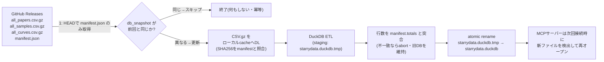
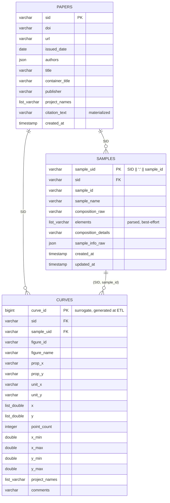
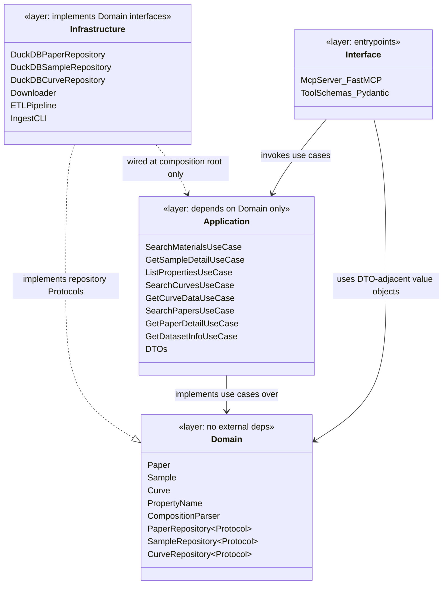

# starrydata-mcp アーキテクチャ設計

- Status: **Draft — 司令塔レビュー待ち (need-review)**
- 作成日: 2026-08-15
- 実装: 未着手(本ドキュメントは調査・設計のみ)

---

## 0. サマリ / 結論

- データ源は Starrydata2 本体が公開している **daily/monthly 配布データセット**(CC BY 4.0)。取得元は
  Google Drive の全量ZIP(1日2回更新)か、GitHub Releases の gzip CSV(1日1回、~03:00 JST 更新)の
  いずれかで、後者を一次ソースとして推奨する(§1.4 で理由を説明。要HQ確認 → §5 Q2)。
- ローカルDBは **DuckDB** を推奨(§2)。
- MCPサーバーは **ローカルにインストールして使う stdio サーバー**とし、変換済みDBは配布しない
  (§3.5)。CLAUDE.md の「変換済みDBの再配布はしない」制約をそのまま満たす構成。
- MCPツールは 8 個(§3)。「探す→絞る→取得する」の3段階になるよう粒度を分けた。
- クリーンアーキテクチャの層構成は §4。ドメイン層カバレッジ目標 95%、アプリケーション層 90% を提案。
- 未決事項・要確認事項は §5 にまとめた。

---

## 1. Starrydata公開データセットの調査結果

実際に GitHub API 経由でリポジトリ内容を確認し、全量CSV(gzip、papers 9.5MB / samples 4.7MB /
curves 43MB、解凍後 計 334MB)をダウンロードしてスキーマを実データで検証した。

### 1.1 配布チャネル(README実物より)

| チャネル | 内容 | 更新頻度 | 提供開始 |
|---|---|---|---|
| Google Drive フォルダ | 全量 `starrydata_dataset.zip`(生CSV3本、~130MB相当) | 1日2回 (00:00, 12:00 JST) | 2024/06/13〜 |
| **GitHub Releases**(`starrydata/starrydata_datasets`) | 全量+プロジェクト別 `*.csv.gz` + `manifest.json` | 1日1回 (~03:00 JST) | 2026/06/25〜 |
| Figshare | アーカイブスナップショット | 2024/06/06以前は日次、以降は月次 | 2022/12/22〜 |
| GitHub tags(同リポジトリ) | レガシースナップショット | 随時 | 2019/07/11〜2022/12/22 |

Google Driveのフォルダは認証なしのHTTP GETではファイル一覧を機械的に取得できない(JS実行が必要)。
GitHub Releasesは `.../releases/latest/download/<FILENAME>` という**固定URL**で全ファイルに
認証なしアクセスでき、`manifest.json` に行数・バイト数・SHA256・DBスナップショット時刻が
機械可読な形で入っている。GitHub Releasesの元データはこのGoogle Drive ZIPそのもの
(README記載のワークフロー: ZIP取得→`scripts/split.py`→Release公開)なので、スキーマは同一。

### 1.2 ファイル構成・スキーマ(実データで確認)

3テーブル構成、CSV(UTF-8, BOM無し)。

**`all_papers.csv`**(56,521行、15列)
```
SID, DOI, URL, issued, author, title, container_title, container_title_short,
volume, issue, page, ISSN, publisher, project_names, created_at
```
- `issued` は CrossRef形式のJSON文字列 `{"date_parts":[[2014,4,15]]}`
- `author` はJSON配列 `[{"affiliation":[],"given":"Chong","family":"Xiao"}, ...]`
- `project_names` はJSON配列文字列 `["ThermoelectricMaterials","GeneralDB"]`
- 1論文が複数の `SID` を持つケースがある(56,521行 vs `manifest.totals.papers`=17,399 = curvesに
  実データが紐づく論文数)。**`SID` は論文キーではなく「データ登録セット」キー**と解釈する必要がある。

**`all_samples.csv`**(105,397行、9列)
```
sample_name, sample_id, composition, composition_details, SID, DOI,
created_at, updated_at, sample_info
```
- `sample_id` は **論文内ローカルの連番**であり、グローバルにユニークではない(READMEが明記)。
  グローバルキーは `(SID, sample_id)` の複合キー。
- `composition` は多くが化学式文字列(`Pb1Te1.01Na0.02` 等)だが、**自由記述テキストが混入する**
  (例: `"PH1000 with DMSO (dimethyl sulfoxide) doping agent. ..."`)。組成パースは失敗を許容する
  設計が必須(§2.3)。
- `sample_info` は登録UIのカテゴリ別メタデータをフラットに詰めたJSON文字列
  (`FabricationProcess`, `MaterialFamily`, `DataType`, `RelativeDensity` 等、キー表記に大文字小文字
  ・空白・タイポ揺れが多数存在、値が空文字のキーも大量に含む)。**汚いキー空間**であり、
  正規化せず「ホワイトリストのキーのみ抽出+残りはraw JSONとして保持」が安全。

**`all_curves.csv`**(234,390行、16列)
```
SID, DOI, composition, sample_id, figure_id, figure_name, prop_x, prop_y,
unit_x, unit_y, x, y, created_at, updated_at, project_names, comments
```
- **明示的な curve 主キーが存在しない**。`(SID, sample_id, figure_id, prop_x, prop_y)` でも一意性は
  保証されない(同一図に複数系列があり得る)ため、DB側でサロゲートキー `curve_id`
  (連番/ハッシュ)を生成する。
- `x`, `y` は数値配列のJSON文字列(例 `[299.8597,324.8683,...]`)。要素数は可変(数点〜数十点)。
- `prop_x`/`prop_y` は統制語彙的だが表記揺れがある(例: `magnetization_per_weight` のように
  他フィールドと命名規則が異なるものが混在)。上位20件は Temperature×{Seebeck係数, 熱伝導率,
  電気抵抗率, ZT, 電気伝導率, パワーファクター, 誘電率...} が支配的(熱電材料が主要ドメイン)。
- `project_names` により研究ドメイン別に分類されている。実データでの内訳(curves数、重複あり):
  ThermoelectricMaterials 155,758 / BatteryMaterials 32,586 / MagneticMaterials 16,912 /
  DielectricMaterials 16,555 / GeneralDB 7,507 / CondensedMatter 6,848 / ほか10プロジェクト。

**`manifest.json`**(GitHub Pagesでも配信: `https://starrydata.github.io/starrydata_datasets/manifest.json`)
```jsonc
{
  "generated_at": "...",           // manifest生成時刻(UTC)
  "db_snapshot": "2026-08-15 02:00:02 UTC+0900 (JST)",  // 冪等判定に使う一次キー
  "totals": {"papers":17399,"figures":60302,"samples":105397,"curves":234390},
  "all_data": {"papers":{"filename":..,"rows":..,"bytes":..,"sha256":..}, "samples":{...}, "curves":{...}},
  "projects": {"<ProjectName>": {"papers":{...},"samples":{...},"curves":{...},"counts":{...}}, ...}
}
```

### 1.3 ライセンス(実データで確認)

- NIMS Materials Data Repository (MDR) の当該データセット公式ページ
  (`mdr.nims.go.jp/datasets/be1aaf76-761d-4b73-8ba4-f958348efade`)にて
  **"Creative Commons BY Attribution 4.0 International" (CC BY 4.0)** と明記を確認。
- 推奨引用:
  > Katsura, Kumagai, Mato, Takada, Ando, Fujita, Hosono, Koyama, Mudasar, Phuong, Saito, Sakamoto,
  > Tanaka, Yana, Kimura, Tsuda, Demura. *Starrydata: from published plots to shared materials data.*
  > Science and Technology of Advanced Materials: Methods, 5(1), 2506976 (2025).
  > https://doi.org/10.1080/27660400.2025.2506976
- **注記**: これは私(本ワーカー)が独自に一次情報(MDR公式ページ)で確認した結果であり、
  CLAUDE.mdが定める「real-chart-benchワーカーの調査結果をHQ経由で受け取る」正式フローを
  代替するものではない。CC BY 4.0は再配布(商用可)を許諾しているが、**CLAUDE.mdの現行方針
  (変換済みDB非配布)は本ドキュメントでも維持**し、正式確認が下りるまで変更しない(§5 Q1)。
  なお余談だが、引用著者リストに "Tomoya Mato" の名があり、オーナー(ユーザー)と同姓同名。
  本人であれば一次情報へのアクセスが容易な可能性がある(裏取りはしていない、事実の指摘のみ)。

### 1.4 GitHub Releasesを一次ソースに推奨する理由

CLAUDE.mdは「データセットZIP」という表現だが、実際に存在する配布チャネルのうち機械的な
日次自動取得に最も適するのは Google Drive ZIP ではなく GitHub Releases だと判断した:

| 観点 | Google Drive ZIP | GitHub Releases (`.csv.gz`) |
|---|---|---|
| 認証 | 不要だがJS実行必須、URLがフォルダ単位で不安定 | 不要、固定URL |
| 変更検知 | ファイルハッシュ等をAPI無しで取得困難 | `manifest.json` に SHA256/行数/スナップショット時刻 |
| 冪等更新 | 自前でハッシュ計算するしかない | `db_snapshot` 文字列比較だけで前日と同一か判定可 |
| 部分取得 | 不可(1ファイルZIP) | プロジェクト別ファイルを個別取得可(将来の軽量化に有利) |
| ライセンス表示 | ZIP内テキストのみ(未確認) | 同一データ、READMEに配布経緯明記 |

元データは同一(Google Drive ZIPをGitHub Actionsが毎日変換して再配布しているだけ)なので、
スキーマ・内容に差はない。**この差し替えはHQの承認事項として明記する**(§5 Q2)。

---

## 2. 日次取得 → ローカルDB変換パイプライン

### 2.1 DuckDB vs SQLite 比較

| 観点 | DuckDB | SQLite |
|---|---|---|
| ワークロード適性 | 列指向・分析クエリ(範囲フィルタ、集計)に強い | 行指向・点検索(PK lookup)に強い |
| 配列型 | `LIST<DOUBLE>` をネイティブサポート、x/y曲線をそのまま1カラムに格納可能 | 無し。正規化して point 別の行に展開が必要(curves 234,390行 × 平均点数でおそらく数百万行) |
| JSON | ネイティブJSON関数(`json_extract`等)で `sample_info`/`project_names` を直接クエリ可 | JSON1拡張で可能だが機能が薄い |
| 全文検索 | FTS拡張あり(論文タイトル/著者検索用) | FTS5あり、実績豊富 |
| 読み取り専用マルチプロセス | 1プロセスがread-onlyで開けば複数リーダー可、書き込みは単一プロセスのみ | 複数リーダー+単一ライターがWALモードで安定動作、実績最多 |
| ファイルサイズ/性能 | 334MB CSV → 数十MB程度のDuckDBファイルに収まる見込み、集計が高速 | 同等データ量でも動くが範囲集計は遅い傾向 |
| Python生態系 | `duckdb` パッケージ、`read_csv_auto`で高速バルクロード | 標準ライブラリ`sqlite3`、枯れている |
| 組み込みやすさ(MCP配布) | 単一バイナリ埋め込み、pipインストールのみで完結 | 同様に完結 |

**推奨: DuckDB。** 理由:
1. アクセスパターンが「組成/元素/物性でサンプルを絞り込み → 曲線のx/y配列をそのまま返す」という
   分析寄りの検索であり、点別正規化テーブルへのJOINより `LIST<DOUBLE>` 1カラムの方が
   実装もクエリも単純で高速。
2. `project_names`・`sample_info` のJSON構造をそのままクエリでき、ETLでの正規化コストを削減できる。
3. ゾーンマップ(min/max自動索引)により `x_min`/`x_max` 列を足すだけで温度域フィルタ等が高速。
4. 日次パイプラインは「書き込みは1プロセスのみ・その後は読み取り専用」という利用形態と
   DuckDBの制約(同時書き込み不可)が自然に一致する。

### 2.2 更新パイプライン設計



- **冪等性**: `manifest.json` の `db_snapshot` を `~/.cache/starrydata-mcp/state.json` に保存し、
  前回と同一ならCSVダウンロードすらスキップする。同一入力からは常に同一のDuckDBファイルが
  再構築される(差分更新ではなく毎回フルリビルド。234K〜105K行規模なら数秒〜数十秒で完了見込みのため、
  複雑な増分マージロジックより単純フルリビルドの方が壊れにくいと判断)。
- **失敗時の安全性**: ETLは一時ファイル(`.tmp`)に書き込み、行数検証をパスしてから
  atomic rename で本番ファイルを差し替える。ダウンロード/ETL失敗時は既存DBをそのまま使い続ける
  (MCPサーバーは古くても動き続ける。鮮度は `get_dataset_info` ツールで申告)。
- **トリガー**: `starrydata-mcp ingest` というCLIサブコマンドとして実装し、ユーザー環境の
  cron/launchd/Task Scheduler、またはGitHub Actionsセルフホストではなく**ユーザーのローカル環境**で
  日次実行してもらう(§3.5のローカルファースト方針に合わせる)。MCPサーバー起動時にも
  スナップショット鮮度をチェックし、閾値(既定24h)を超えていれば `get_dataset_info` の応答に
  警告フラグを含める(自動再取得はしない = MCPツール呼び出し中に130MB DLでブロックさせない)。

### 2.3 DuckDBスキーマ(論理設計)



- `elements`: `composition_raw` から元素記号を正規表現で抽出したベストエフォート列。
  パース失敗(自由記述テキスト等)時は空リストとし、検索は `composition_raw` への部分一致に
  フォールバックする(§5 Q3で妥当性を確認)。
- `citation_text`: APA風の引用文字列をETL時に生成・保存し、MCPツール応答にそのまま使えるようにする
  (LLMOのための前処理)。
- FTS拡張で `papers.title`/`authors` と `samples.composition_raw` にインデックスを張り、
  あいまい検索を可能にする。

---

## 3. MCPツール定義一覧

設計方針: 「①探す(検索・軽量な要約を返す) → ②詳細を見る(1件を深掘り) → ③生データを取る
(配列本体)」の3段階でツールを分離し、エージェントが不要に大きなレスポンス(数百件分のx/y配列)を
一度に抱え込まないようにする。全ツールの `description` はエージェントが**読むだけで正しく使える**
文面にする(LLMO)。

| # | ツール名 | 役割 |
|---|---|---|
| 1 | `search_materials` | 組成・元素・研究ドメインでサンプルを検索 |
| 2 | `get_sample_detail` | 1サンプルの詳細(組成・作製法・測定条件・保有曲線一覧) |
| 3 | `list_properties` | 物性名・単位の語彙カタログ(曖昧検索の起点) |
| 4 | `search_curves` | 物性ペア・数値範囲・組成で曲線を検索(軽量サマリのみ) |
| 5 | `get_curve_data` | 曲線IDを指定してx/y配列本体を取得 |
| 6 | `search_papers` | DOI・著者・タイトル・年で論文検索 |
| 7 | `get_paper_detail` | 1論文の詳細+紐づくサンプル/曲線一覧 |
| 8 | `get_dataset_info` | ローカルDBの鮮度・件数・ライセンス・引用情報 |

### 3.1 `search_materials`

```
description:
  Starrydataのサンプルを化学組成・構成元素・研究ドメイン(熱電/電池/磁性/誘電体など)で検索する。
  物性曲線を取得する前に、まずこのツールで対象サンプルの候補を絞り込むこと。
  composition は化学式文字列(例 "Bi2Te3")への部分一致で曖昧検索する。
  組成式の表記揺れ(化学量論係数の違いなど)を無視して探したい場合は、
  composition の代わりに elements(例 ["Bi","Te"])を指定するとAND条件の元素検索になる。
  戻り値は軽量なサマリ(sample_uid, composition, project_names, 保有物性の一覧)のみで、
  曲線の実データは含まない。詳細は get_sample_detail、曲線データは search_curves →
  get_curve_data で取得すること。

parameters:
  composition?: string       # 部分一致、例 "Bi2Te3"
  elements?: string[]        # 元素記号のAND検索、例 ["Bi","Te"]
  project?: string           # "ThermoelectricMaterials" 等。list_properties/get_dataset_infoで確認可
  limit?: int = 20
  offset?: int = 0
```

### 3.2 `get_sample_detail`

```
description:
  sample_uid(search_materials/search_curvesの戻り値に含まれるサンプルの一意キー)を指定し、
  組成・作製プロセス・測定手法などのメタデータと、そのサンプルで測定された全ての物性曲線の
  一覧(物性ペア・単位・データ点数のみ、xy配列本体は含まない)を返す。
  曲線本体が必要な場合は、この応答に含まれる curve_id を get_curve_data に渡すこと。

parameters:
  sample_uid: string
```

### 3.3 `list_properties`

```
description:
  Starrydataの曲線に記録されている物性名(prop_x/prop_y)と対応する単位の一覧を、
  データ件数の多い順に返す。物性名は図の軸ラベルからそのまま抽出された統制語彙的な文字列
  (例 "Seebeck coefficient" / "V*K^(-1)")であり、表記揺れがあるため、
  search_curves に渡す prop_x/prop_y の正確な値が分からない場合は必ず先にこのツールで確認すること。
  適当な物性名を推測して search_curves に渡すと、ヒットせず空振りになることがある。

parameters:
  project?: string
  top_n?: int = 50
```

### 3.4 `search_curves`

```
description:
  測定された物性曲線(例: Seebeck係数 vs 温度)を、物性ペア・組成/元素・x軸の数値範囲・
  研究ドメインで検索する。prop_x/prop_yは list_properties で確認した正確な文字列を渡すこと。
  x_min/x_maxを指定すると、その範囲を含む(または重なる)曲線だけに絞り込める
  (例: 300〜500Kのデータが欲しい場合)。
  戻り値は曲線ごとの軽量なサマリ(curve_id, sample_uid, composition, 単位, データ点数,
  x/yの実測範囲, 出典論文のDOI)のみで、xy配列本体は含まない。
  実データが必要な場合は、絞り込んだ curve_id を get_curve_data に渡すこと
  (曲線を大量に返すとレスポンスが肥大化するため、まずこちらで候補を絞ること)。

parameters:
  prop_x?: string
  prop_y?: string
  composition?: string
  elements?: string[]
  x_min?: number
  x_max?: number
  project?: string
  limit?: int = 20
  offset?: int = 0
```

### 3.5 `get_curve_data`

```
description:
  curve_id(1件または複数件)を指定し、実際の(x, y)データ点配列と軸名・単位・
  出典サンプル/論文の引用情報を取得する。search_curves や get_sample_detail で
  候補を絞り込んだ後に呼ぶこと。一度に多数のcurve_idを渡すと配列データの合計サイズが
  大きくなるため、目安として一度に20件以内を推奨する。

parameters:
  curve_ids: int[]   # 1〜20件程度を推奨
```

### 3.6 `search_papers`

```
description:
  Starrydataに収録されている論文をDOI・著者名・タイトルのキーワード・出版年で検索する。
  特定の文献を起点にその論文が持つサンプル/曲線を辿りたい場合や、
  すでに見つけた材料データの引用情報を確認したい場合に使う。
  戻り値には整形済みの引用文字列(citation_text)が含まれる。

parameters:
  doi?: string
  author?: string
  title_keyword?: string
  year_min?: int
  year_max?: int
  project?: string
  limit?: int = 20
  offset?: int = 0
```

### 3.7 `get_paper_detail`

```
description:
  SID(論文の登録セットキー)を指定し、書誌情報・引用文字列に加えて、
  その論文から抽出された全サンプルと全曲線の一覧(サマリのみ)を返す。
  1つの論文が複数の材料・複数の測定図を含むことが多いため、
  「この論文のデータを全部見たい」という要求にはこのツールを使う。

parameters:
  sid: string
```

### 3.8 `get_dataset_info`

```
description:
  このMCPサーバーがクエリしているローカルデータのスナップショット時刻・件数
  (論文/サンプル/曲線数)・ライセンス(CC BY 4.0)・推奨引用文字列・データ取得元URLを返す。
  セッションの最初に一度呼び出し、ユーザーへの回答時にデータの鮮度と出典を
  明記できるようにすること。db_snapshotが24時間以上前の場合、staleフラグがtrueになる
  (ローカルの日次更新ジョブが失敗している可能性がある)。

parameters: (なし)
```

---

## 4. クリーンアーキテクチャ層構成

### 4.1 依存方向



- 依存は常に **Interface → Application → Domain ← Infrastructure**。矢印がDomainに向かって
  収束する。DomainはDuckDB/MCP SDKを一切importしない(Protocol/インターフェースのみ定義)。
- **例外(意図的な逸脱)**: 日次ETL(`Infrastructure/ingestion`)はDuckDBのSQL
  (`read_csv_auto` + `COPY`)でバルク変換を行い、234K〜105K行をPythonのドメインオブジェクト経由で
  1行ずつ生成する設計は採らない(性能・実装コストの見合わない複雑化のため)。
  ETLはInfrastructure層内で完結する「一括データ整形バッチ」として扱い、ドメイン層の
  リポジトリ実装(`DuckDBCurveRepository`等、MCPツールから呼ばれる読み取りパス)とは
  コードパスを分離する。ドメインの純粋性要件は「検索・ビジネスロジックを担う層」に適用し、
  ETLのSQL変換ロジックには適用しない、という整理をCLAUDE.mdの精神(内側への依存)に沿う形で明記する。

### 4.2 ディレクトリ構成(提案)

```
src/starrydata_mcp/
  domain/
    entities.py        # Paper, Sample, Curve, PropertyName (dataclass/値オブジェクト)
    repositories.py     # Protocol: PaperRepository, SampleRepository, CurveRepository
    composition.py      # CompositionParser (純粋関数、外部依存なし)
    citation.py          # 引用文字列フォーマットロジック(純粋関数)
  application/
    dto.py               # ツールの入出力DTO(pydantic)
    use_cases/
      search_materials.py
      get_sample_detail.py
      list_properties.py
      search_curves.py
      get_curve_data.py
      search_papers.py
      get_paper_detail.py
      get_dataset_info.py
  infrastructure/
    duckdb/
      connection.py           # read-only接続、ファイル差し替え検知
      paper_repository.py
      sample_repository.py
      curve_repository.py
    ingestion/
      downloader.py            # GitHub Releases取得、manifest突合
      etl.py                    # DuckDB SQLによる変換
      cli.py                     # `starrydata-mcp ingest`
  interface/
    mcp_server.py                # FastMCPでツール登録、`starrydata-mcp serve`
  config.py                       # キャッシュディレクトリ・閾値等
tests/
  domain/            # 純粋ユニットテスト(外部IO無し)
  application/        # フェイクリポジトリでのユースケーステスト
  infrastructure/      # 小さな固定サンプルCSVを使った統合テスト
  interface/             # MCP in-process test clientでのスモークテスト
```

### 4.3 技術スタック推薦

| 用途 | 技術 |
|---|---|
| 言語/実行環境 | Python 3.12+ |
| MCP実装 | 公式 `mcp` Python SDK(FastMCPでツール登録) |
| ローカルDB | DuckDB(`duckdb` パッケージ) |
| DTO/バリデーション | Pydantic v2 |
| HTTPクライアント(ダウンロード) | `httpx`(ストリーミング・リトライ対応) |
| CLI | `typer` または標準 `argparse`(`starrydata-mcp ingest` / `serve`) |
| Lintフォーマット | `ruff` |
| 型検査 | `mypy --strict`(domain/application層) |
| レイヤー依存検査 | `import-linter`(CIで強制、§4.1の依存方向を契約化) |
| テスト | `pytest` + `pytest-cov` |
| CI | GitHub Actions(lint, mypy, import-linter, pytest, coverage gate) |
| パッケージ配布 | PyPI(現状private方針のため、CI設定のみ用意しpublish自体は保留。タグ運用はCLAUDE.md通りHQ承認後) |

### 4.4 テストカバレッジ目標(提案・要HQ確定)

| 層 | 目標カバレッジ | テスト手法 |
|---|---|---|
| domain | **95%以上** | 純粋ユニットテスト。外部IO無し、組成パーサ・引用フォーマッタの境界値を網羅 |
| application | **90%以上** | ドメインProtocolのフェイク実装(in-memory)でユースケースを検証 |
| infrastructure(duckdb repository) | 明示的な%目標は設定せず、主要クエリパターン(組成部分一致・元素AND・x範囲フィルタ・JOIN)を固定サンプルCSV(数十行)で統合テスト | pytest fixture DB |
| infrastructure(ingestion) | 同上。ダウンロード失敗時のフォールバック、manifest不一致時のabort、冪等スキップを重点的にテスト | pytest + モックHTTP |
| interface(MCP server) | 明示的な%目標は設定せず、8ツール全てにつき「正常系1件+空振り1件」のスモークテストをMCP SDKのin-processクライアントで実施 | pytest |
| **リポジトリ全体** | **85%以上**(CI gate) | 上記の合算 |

---

## 5. 未決事項・リスク(司令塔確認事項)

1. **【Q1: ライセンス確認フロー】** 本ドキュメントは私が独自にMDR公式ページでCC BY 4.0を確認したが、
   CLAUDE.mdが定める正式フロー(real-chart-benchワーカー経由)はまだ完了していない。
   このドキュメントでは安全側に倒し「変換済みDB非配布」方針を維持したが、正式確認後に
   再配布可否の方針が変わる可能性がある。実装着手前にHQで正式フローの結果を確定してほしい。
2. **【Q2: データ取得元の差し替え承認】** CLAUDE.mdの「データセットZIP」という表現に対し、
   本設計はGoogle Drive ZIPではなくGitHub Releasesの`.csv.gz`+`manifest.json`を一次ソースとして
   採用する(§1.4に理由)。同一データだが配布形態が異なるため、承認をお願いしたい。
3. **【Q3: 組成パース失敗時の許容範囲】** `composition`列には化学式でない自由記述が混入する
   (実データで確認済み)。v1では「パース失敗時はelements=[]、composition_rawへの部分一致に
   フォールバック」という簡易対応とし、`pymatgen`等の本格的な組成正規化ライブラリ導入は
   将来検討(依存が重く、実装の複雑さも増すため)としたい。この判断でよいか確認したい。
4. **【Q4: MCPサーバーの配布・実行形態】** 「変換済みDB非配布」を満たすため、
   本設計は「ユーザーが `starrydata-mcp` をインストールし、ローカルで日次ingestを実行し、
   ローカルDuckDBファイルに対してstdio MCPサーバーを立てる」構成を前提にした
   (Claude Desktop/Claude Code設定に登録して使う形)。ホスティング型・マルチテナント型は
   想定していない。この前提で合っているか確認したい。
5. **リスク: curve主キー不在** `curves`テーブルに一意キーが存在しないため、サロゲート
   `curve_id`をETL時に生成する。ETLを再実行するたびにIDが振り直される(全量リビルド方針のため)。
   エージェント側がcurve_idを長期間キャッシュして使い回すことは想定しない設計とする
   (`get_curve_data`のdescriptionで「直前のsearch_curvesの結果から使うこと」を明記済み)。
6. **リスク: `sample_info`のキー空間が汚い** 実データで空白混じり・大文字小文字違い・タイポの
   キーが多数確認された。`get_sample_detail`ではraw JSONをそのまま返しつつ、
   代表的なキー(FabricationProcess, MaterialFamily, DataType等)のみ正規化フィールドとして
   併記する設計としたい(未実装、実装フェーズで詳細確定)。
7. **軽微な余談**: Starrydata論文の著者リストに"Tomoya Mato"の名があり、オーナーと同姓同名。
   本人であれば一次情報へのアクセスやライセンス確認の近道になり得るため、念のため共有する
   (裏取りはしておらず、判断はHQに委ねる)。

---

## 付録: 実データ検証に使用したコマンド・確認先(再現用メモ)

- `GET https://api.github.com/repos/starrydata/starrydata_datasets`(default_branch=`master`確認)
- `GET https://raw.githubusercontent.com/starrydata/starrydata_datasets/master/README.md`
- `GET https://raw.githubusercontent.com/starrydata/starrydata_datasets/master/scripts/split.py`
- `GET https://starrydata.github.io/starrydata_datasets/manifest.json`
- `GET https://github.com/starrydata/starrydata_datasets/releases/latest/download/{all_papers,all_samples,all_curves}.csv.gz`
  (ダウンロードして解凍し、実データのヘッダ・行数・値の分布をPython/csvで確認)
- `https://mdr.nims.go.jp/datasets/be1aaf76-761d-4b73-8ba4-f958348efade?locale=en`(ライセンス・引用確認)
